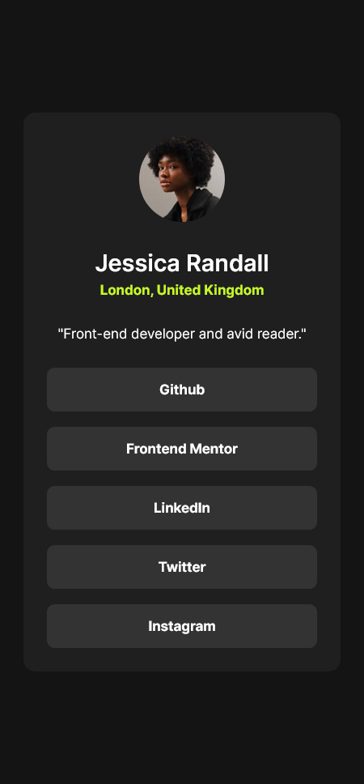
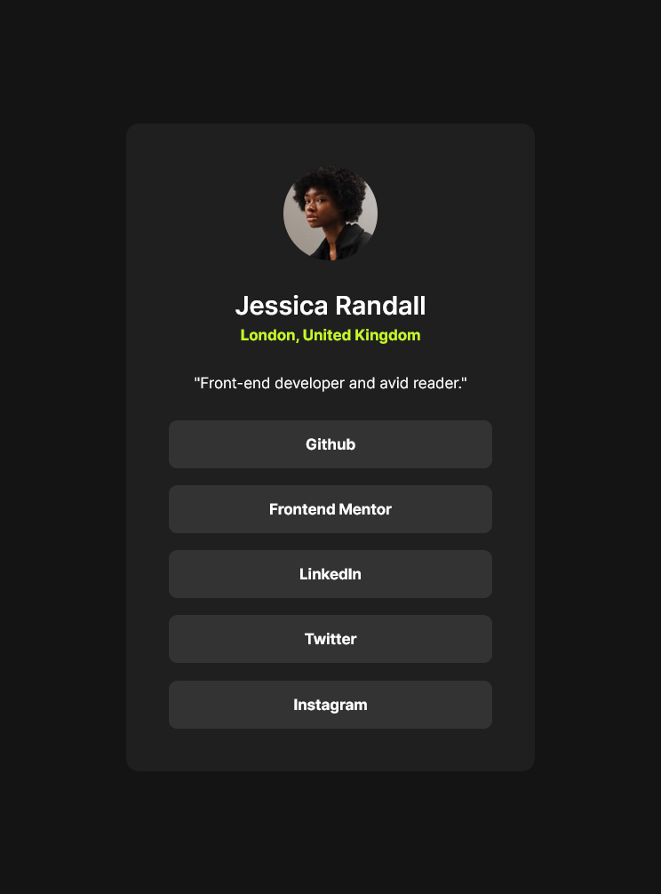
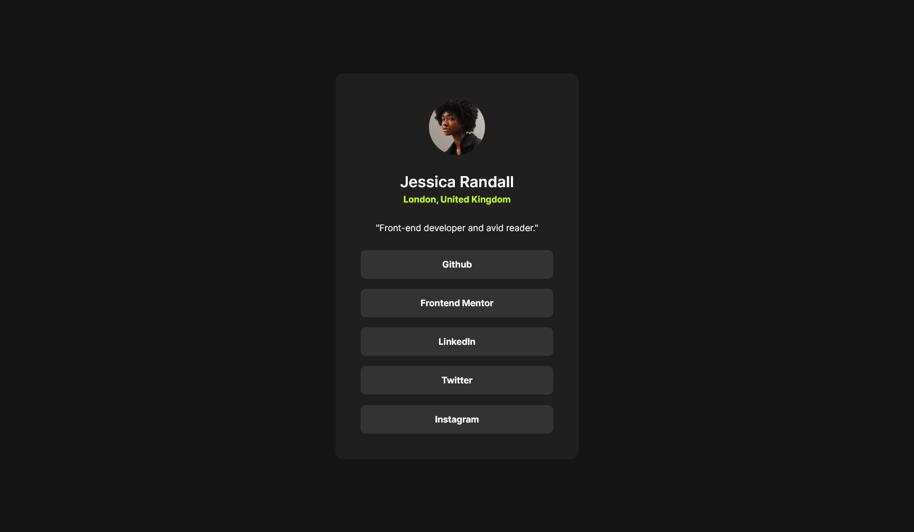

# Frontend Mentor - Social links profile solution - Saurav Kumar verma

This is a solution to the [Social links profile challenge on Frontend Mentor](https://www.frontendmentor.io/challenges/social-links-profile-UG32l9m6dQ). Frontend Mentor challenges help you improve your coding skills by building realistic projects.

## Table of contents

- [Overview](#overview)
  - [The challenge](#the-challenge)
  - [Screenshot](#screenshot)
  - [Links](#links)
- [My process](#my-process)
  - [Built with](#built-with)
  - [What I learned](#what-i-learned)
  - [Useful resources](#useful-resources)
- [Author](#author)
- [Acknowledgments](#acknowledgments)

## Overview

### The challenge

Users should be able to:

- See hover and focus states for all interactive elements on the page

### Screenshot

#### Mobile View

#### Tablet View

#### Desktop View

### Links

- Solution URL: [https://github.com/saurav-verma-01/Social-links-profile](https://github.com/saurav-verma-01/Social-links-profile)
- Live Site URL: [https://social-links-proof-sv.netlify.app/](https://social-links-proof-sv.netlify.app/)

## My process

### Built with

- Semantic HTML5 markup
- CSS custom properties
- Flexbox
- Mobile-first workflow
- CSS Media Queries
- CSS Variables
- Figma
- Github

### What I learned

I am thrilled to share my successful completion of another Frontend Mentor challenge, where I placed a strong emphasis on precision, responsiveness, and code efficiency. By dedicating an additional 15 minutes to thoughtful planning, I managed to significantly reduce my codebase by 50%, showcasing my commitment to crafting clean and concise HTML and CSS.

Throughout this project, I strengthened my skills in layout architecture and learned to approach styling with a strategic mindset. The meticulous attention to detail in replicating the design was made possible by utilizing Figma as a valuable design tool. This not only enhanced my visual acumen but also improved the overall quality of the project.

One notable aspect of my achievement is the integration of GitHub into my workflow. Saving my code at every step not only reflects discipline but also ensures a solid foundation for collaboration and facilitates future iterations.

In essence, this accomplishment not only demonstrates my technical proficiency but also highlights my dedication to continuous improvement, efficiency, and best practices in frontend development. I'm excited to build upon these experiences and tackle more challenges in the future.

### Useful resources

- [Netlify](https://app.netlify.com/) - This helped me Hosting my webpage for free.
- [necoCalc](https://nekocalc.com/px-to-rem-converter) - This helped me smoothly calculating the space and sizes in rem.Making the page more responsive.

## 🔗 Author

